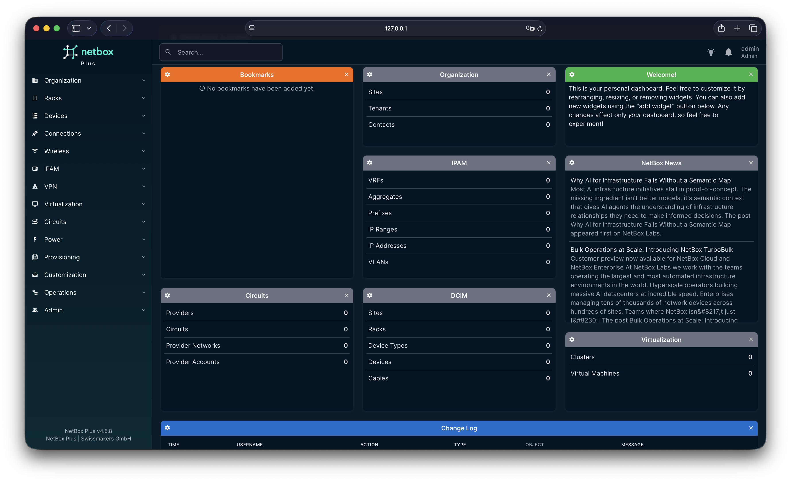
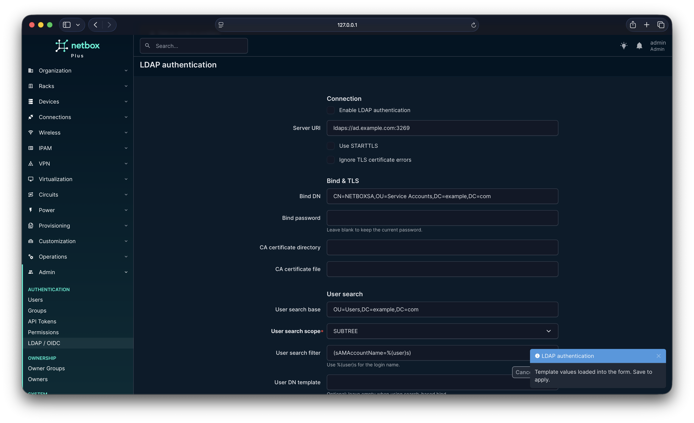

# NetBox Plus

**NetBox Plus** is a community-oriented fork of [NetBox](https://github.com/netbox-community/netbox), the open-source network source-of-truth and infrastructure resource modeling (IRM) tool. It is developed and maintained by **[Swissmakers GmbH](https://swissmakers.ch)**.

NetBox Plus is **not** [NetBox Enterprise](https://netboxlabs.com/netbox-enterprise/). It is a **separate product path**: free software, **intended to remain free**, with optional **commercial support** available from Swissmakers GmbH for organizations running NetBox.

What is different? For example the LDAP and OIDC integration directly configurable via authentication manager is one feature that is already integrated with NetBox Plus. The goal is to extend NetBox in ways that matter to engineers, without paywalling important product features.

## What you get

NetBox Plus inherits the full NetBox data model, APIs, plugins ecosystem, and operational patterns you already know: DCIM, IPAM, circuits, virtualization, permissions, change logging, and more.

On top of that, NetBox Plus will add Swissmakers improvements such as hardenings, container-files, documentation, packaging, and additional features. Roadmap items will be documented in this repository as they land.

## Container image

This repository includes a **Dockerfile** and **Compose** stack (PostgreSQL, Redis, Gunicorn, RQ workers) based on **Red Hat UBI** (UBI 9 by default; UBI 10 optional on capable CPUs). See `docker/` and `docker-compose.yml`.

**Swissmakers recommends [Podman](https://podman.io/)** for this stack on Linux; examples use `podman compose`. See [Containers with Podman Compose](docs/installation/docker.md) for commands and why Podman is the documented default.

### Pre-built image (Swissmakers)

Official multi-arch builds are published to Docker Hub as **[`swissmakers/netbox-plus`](https://hub.docker.com/repository/docker/swissmakers/netbox-plus)**. From the repo root run `podman compose pull` and `podman compose up -d` (Compose defaults to that image; override `NETBOX_IMAGE` in `.env` for another tag or registry). More detail: [Containers with Podman Compose](docs/installation/docker.md) and `docker/README.md`.

### Build from source

Build and tag a local development image directly from the repository root:

```bash
podman build -t netbox-plus:dev .
```

Then set `NETBOX_IMAGE=localhost/netbox-plus:dev` in `.env` and start the stack:

```bash
cp docker/.env.example .env
# Edit .env —> set NETBOX_SECRET_KEY and NETBOX_IMAGE=localhost/netbox-plus:dev
podman compose up -d
# UI: http://localhost:8080
```

## Documentation

- **NetBox Plus authentication (LDAP / OIDC):** [Enterprise authentication](docs/administration/authentication/enterprise-auth.md), [LDAP installation](docs/installation/6-ldap.md)
- **Upstream NetBox docs** (concepts and features): [docs.netbox.dev](https://docs.netbox.dev)

## Screenshots

- Home user interface
<p align="center">
  
</p>

- LDAP authentication settings
<p align="center">
  
</p>

## License

**NetBox Plus is licensed under the GNU General Public License v3 (GPL-3.0)** from the fork onward. See [`LICENSE.txt`](LICENSE.txt) for the full license text and a **copyright / upstream notice** that explains how this relates to original NetBox (Apache-2.0) code.

Some files that were **not substantively modified** after the fork may still carry **original NetBox or third-party copyright and license headers**. Those notices take precedence for those specific files; the `LICENSE.txt` preamble summarizes the intent.

## Contributing & support

Community contributions are welcome; see [CONTRIBUTING.md](CONTRIBUTING.md) for the project’s contribution workflow.

For **professional support, consulting, or SLAs** on NetBox Plus, contact **Swissmakers GmbH**.


## Acknowledgements

NetBox Plus builds on the work of the **NetBox community** and **NetBox Labs** / upstream contributors. We are grateful for the project they created and maintain upstream.