# Installation

The installation instructions provided here have been tested to work on Rocky Linux 10. The particular commands needed to install dependencies on other distributions may vary significantly. Unfortunately, this is outside the control of the NetBox maintainers. Please consult your distribution's documentation for assistance with any errors.

For **NetBox Plus** using containers, Swissmakers provides an official image on Docker Hub and a Compose stack in the repository. See **[Containers with Podman Compose (NetBox Plus)](docker.md)** for the pre-built image, `podman compose` commands, why Podman is recommended, and how to set `NETBOX_IMAGE`.

The following sections detail how to set up a new instance of NetBox on a Linux host (traditional install):

1. [PostgreSQL database](1-postgresql.md)
2. [Redis](2-redis.md)
3. [NetBox components](3-netbox.md)
4. [Gunicorn](4a-gunicorn.md) or [uWSGI](4b-uwsgi.md)
5. [HTTP server](5-http-server.md)
6. [LDAP authentication](6-ldap.md)

## Requirements

| Dependency | Supported Versions |
|------------|--------------------|
| Python     | 3.12, 3.13, 3.14   |
| PostgreSQL | 14+ [^1]           |
| Redis      | 5.0+ [^2]          |

[^1]: Support for PostgreSQL 14 is deprecated and will be removed in NetBox v4.7. PostgreSQL 15 or later will be required.
[^2]: Support for Redis versions older than 6.0 is deprecated and will be removed in NetBox v4.7. Redis 6.0 or later will be required.

Below is a simplified overview of the NetBox application stack for reference:

```mermaid
flowchart TB
    nginx["<span style='color:#fff'><b>nginx / Apache</b><br/>HTTP reverse proxy</span>"]:::red
    gunicorn["<span style='color:#fff'><b>gunicorn</b><br/>WSGI HTTP server</span>"]:::orange
    rqworker["<span style='color:#fff'><b>rqworker</b><br/>Background worker</span>"]:::pink
    netbox["<span style='color:#fff'><b>NetBox</b><br/>Django application</span>"]:::blue
    django["<span style='color:#fff'><b>Django</b><br/>Python application framework</span>"]:::green
    storage["<span style='color:#fff'><b>Storage Driver</b><br/>Static asset storage</span>"]:::gray
    postgres["<span style='color:#fff'><b>PostgreSQL</b><br/>Relational database</span>"]:::teal
    redis["<span style='color:#fff'><b>Redis</b><br/>In-memory store</span>"]:::purple

    nginx --> gunicorn
    nginx --> storage
    gunicorn --> netbox
    rqworker --> netbox
    netbox --> django
    django --> postgres
    django --> redis

    classDef red fill:#b91c1c,stroke:#7f1d1d,color:#fff
    classDef orange fill:#c2410c,stroke:#7c2d12,color:#fff
    classDef pink fill:#a21caf,stroke:#701a75,color:#fff
    classDef blue fill:#1d4ed8,stroke:#1e3a8a,color:#fff
    classDef green fill:#15803d,stroke:#14532d,color:#fff
    classDef gray fill:#4b5563,stroke:#1f2937,color:#fff
    classDef teal fill:#0f766e,stroke:#134e4a,color:#fff
    classDef purple fill:#6d28d9,stroke:#4c1d95,color:#fff
```

## Upgrading

If you are upgrading from an existing installation, please consult the [upgrading guide](upgrading.md).
